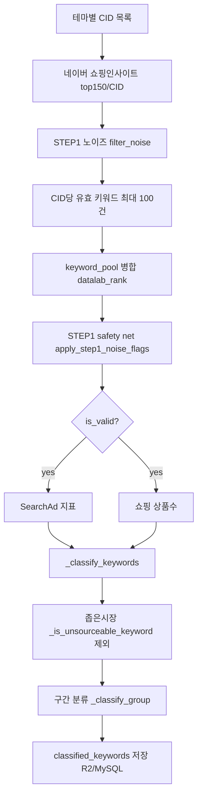

# Admin 키워드 소싱 — 현재 적용 필터 정리

> **기준 커밋:** `8214627` (`9a19d9e` STEP1 노이즈 필터 복원)  
> **진입점:** Admin UI → 키워드 소싱 (`KeywordSourcingService`)  
> **참조 출처:** `vertical_keyword_extraction` / `PORTING_VERTICAL_KEYWORD_EXTRACTION.md` (STEP1·좁은시장 일부만 이식)

---

## 1. 파이프라인 개요



| 단계 | 적용 여부 | 모듈 / 상수 |
|------|-----------|-------------|
| STEP1 노이즈 | ✅ | `keyword_noise.py`, `brand_noise_exclusion.yaml` |
| CID당 유효 cap | ✅ | `VALID_KEYWORD_LIMIT = 100` |
| discovery_post_filter (L1~L4, deepest_win, budget 400) | ❌ **미적용** | 복원 시 제외됨 (`5a56e31` 이전 상태) |
| Enrich 후 좁은 시장 | ✅ | `_is_unsourceable_keyword` |
| 구간 분류 (고효율/중간성장/대형) | ✅ | `_classify_group` |
| 독점 의심 라벨 | ✅ | `_monopoly_suspect_label` (제외 아님, 표시만) |

---

## 2. STEP1 노이즈 필터

### 2.1 적용 시점

1. **CID 수집 직후** — `filter_noise(raw_keyword_list)` 로 유효/노이즈 분리  
2. **전체 CID 완료 후** — `apply_step1_noise_flags(top_keywords)` safety net (추가 제외 건수 로그)

### 2.2 구현 파일

| 파일 | 역할 |
|------|------|
| `app/services/keyword_noise.py` | `is_step1_noise()`, `filter_noise()`, `normalize_keyword()` |
| `app/config/brand_noise_exclusion.yaml` | 브랜드·디바이스·IP 목록 (유형 A/B/C) |
| `tests/test_step1_noise_filter.py` | 학습 샘플 54건 + 일반 키워드 통과 테스트 |

### 2.3 정규화

- `unicodedata.normalize("NFKC")`
- 제어문자 제거, 공백 제거, **소문자** (`normalize_keyword`)

### 2.4 제외 규칙 (`is_step1_noise` → `True`)

#### A. YAML `exact_brands` (정규화 후 **완전 일치**)

예: 가민, 케이스티파이, 셀루미, 스마트워치, 픽디자인, …  
→ 전체 목록: `app/config/brand_noise_exclusion.yaml`

#### B. YAML substring (`device_series`, `brand_fragments`, `character_ip`)

- **device_series:** 갤럭시, 애플워치, 아이폰16/17, 플립/폴드 시리즈, 샤오미, 가민포러너, …
- **brand_fragments:** 나이키, 아디다스, LG전자, 정품인증, 공식몰, 키엘, 퍼실, …
- **character_ip:** 키티, 헬로키티
- 코드 기본값 `DEFAULT_BRAND_SUBSTRINGS` + 삼성/애플/apple 도 항상 포함

#### C. 코드 내장 — 탐색·B2B·오프라인 (`_EXPLORATION_NOISE_SUBSTRINGS`)

| 유형 | 포함 토큰 예 |
|------|----------------|
| 오프라인/유통 | 거리, 시장, 매장, 아울렛, 백화점, 다이소, 무인양품, 스타벅스 |
| B2B/도매 | 도매, 도매몰, b2b, mro, 업체, 공장, 위탁, 창업 |
| 기타 | 중고, 분양, 입양, 보호소, 업소용, 맛집, 인쇄, … |

#### D. 탐색·정보 의도

- **substring:** 후기, 리뷰, 비교, 뜻, 추천순, 사용법, 종류  
- **접미사 정규식** (`_INFO_SUFFIX_RE`): `이란`, `란?`, `뜻`, `방법`, `사용법`, `후기`, `리뷰` 로 끝남  
  - 예: `텀블러란?`, `주방세제사용법` → 노이즈

#### E. 지역 + 카테고리 동시 포함

- **지역** (`_REGION_TOKENS`): 서울, 경기, …, 학성동, 의정부  
- **카테고리** (`_CATEGORY_TOKENS`): 주방용품, 생활용품, 가구, 텀블러, …  
- 둘 다 포함 시 노이즈

#### F. 모델코드

- 정규식: `[A-Z]{2,}\d+` 또는 `\d+[A-Z]{2,}` (예: SKU 형태)

#### G. 카테고리 + B2B/업소용

- `_CATEGORY_TOKENS` 포함 **且** `b2b` 또는 `업소용` 포함

#### H. 지명형 접미사

- 길이 ≥ 3 이고 `동`, `역`, `점` 으로 끝남

#### I. 빈 키워드

- 공백만 → 노이즈

### 2.5 CID 수집 시 cap

```text
valid_keywords = filter_noise(...) 의 유효 목록[:100]
```

- 상수: `KeywordSourcingService.VALID_KEYWORD_LIMIT = 100`
- 노이즈가 아닌 키워드도 **CID당 최대 100개**만 `is_valid=True`
- 풀 병합: 동일 키워드가 여러 CID에 있으면 **datalab rank가 더 좋은(숫자 작은) 행** 유지

---

## 3. Enrich 이후 필터·분류

SearchAd·쇼핑 API 수집 후 `_classify_keywords()` 에서 `is_valid=True` 인 행만 처리.

### 3.1 좁은 시장 / 소싱 부적합 (`_is_unsourceable_keyword`)

아래 **하나라도** 해당하면 **최종 classified 에서 제외** (`continue`).

| 조건 | 상수 | 값 |
|------|------|-----|
| 상품수 너무 적음 | `UNSOURCEABLE_PRODUCT_COUNT_MAX` | `1 ≤ pc ≤ 200` |
| 상품수 너무 많음 (대형) | `UNSOURCEABLE_PRODUCT_COUNT_GTE` | `pc ≥ 1,000,000` |
| CTR 과다 | `UNSOURCEABLE_CTR_MIN` | `monthly_mobile_ctr ≥ 9.9%` |
| 하드코딩 브랜드 토큰 | `UNSOURCEABLE_KEYWORD_TOKENS` | 키워드에 포함 시 제외 (코르딕스루프캐리어, 헬로키티화장지, …) |

> 참조 MD의 “100만+ 제외” 규칙이 `UNSOURCEABLE_PRODUCT_COUNT_GTE` 로 반영됨.

### 3.2 독점 의심 (제외 아님)

| 조건 | 라벨 |
|------|------|
| `201 ≤ product_count ≤ 1000` | `monopoly_suspect = "독점의심"` |

분류 제외가 아니라 **컬럼 표시**용.

### 3.3 구간 분류 (`_classify_group`)

조건 미충족 시 해당 키워드는 classified 에 **포함되지 않음**.

#### 고효율

- 월검색수 `100 ~ 4,999`
  - CTR ≥ 2.5%, 경쟁 낮음/중간, 노출광고 ≤ 7  
  - 또는 CTR ≥ 3.0%, 경쟁 중간/높음, 노출광고 ≤ 9

#### 중간성장

- 월검색수 `5,000 ~ 19,999`
  - 검색 &lt; 10,000 &amp; CTR ≥ 1.5% &amp; 경쟁 낮음/중간 &amp; 노출광고 ≤ 9  
  - 또는 CTR ≥ 1.8% &amp; 경쟁 중간/높음

#### 대형

- 월검색수 `≥ 20,000` &amp; CTR ≥ 1.0%

### 3.4 검색량·CTR 점수 (`app/services/keyword_scoring.py`)

Enrich 후 `_classify_keywords` 에서 각 키워드에 부여:

| 필드 | 규칙 |
|------|------|
| `search_volume_score` | 월검색량 앵커 간 **선형 보간** (100→40, 500→60, 3k→75, 10k→80, 20k→70, **30k→100 피크**, 100k→70) |
| `ctr_score` | CTR(%) **구간 plateau** (≤1.0→30, ≤1.5→40, ≤3.0→60, ≤5.0→80, >5.0→100) |
| `final_score` | **(검색량 점수 + CTR 점수) / 2** — 둘 중 하나라도 없으면 미산출 |

Admin 파이프라인 테이블·엑셀보내기에 **검색량점수**, **CTR점수**, **최종점수** 컬럼 표시.

### 3.5 정렬

classified 결과 정렬 우선순위:

1. 구간: 고효율 → 중간성장 → 대형  
2. 월검색수 내림차순  
3. datalab rank 오름차순

---

## 4. 미적용 항목 (이전 작업에서 복원 제외)

`discovery_post_filter` (`5a56e31`, `9361cfb`) 는 **현재 코드에 없음**.

| 항목 | 비고 |
|------|------|
| `dedupe: deepest_win` | 동일 키워드 → 가장 깊은 category_path 우선 |
| `by_depth` L1~L4 cap | CID 그룹별 50/60/70/80 |
| `enrich_budget: 400` | post-filter 후 enrich 상한 |
| `app/services/discovery_post_filter.py` | 삭제됨 |
| `app/config/keyword_discovery_post_filter.yaml` | 삭제됨 |

다시 켜려면 `5a56e31` 기준 파일 복원 또는 별도 요청 필요.

---

## 5. 로그에서 확인하는 방법

Admin 키워드 소싱 실행 로그 예:

```text
[1/N] {테마} > {카테고리} 수집 시작
[1/N] 쇼핑인사이트 top150 수집 150건 (...)
[1/N] {카테고리} 완료 (top150 150건 / 유효키워드 ≤100건)
...
STEP1 노이즈 safety net: 추가 제외 N건
SearchAd 지표 수집 시작 (M개 키워드)
```

- `discovery_post_filter 설정:` 로그가 **없으면** post-filter 미적용 상태가 맞음.

---

## 6. 관련 파일 인덱스

```
app/services/keyword_noise.py          # STEP1 노이즈
app/services/keyword_sourcing.py       # 오케스트레이션·cap·분류
app/config/brand_noise_exclusion.yaml  # 브랜드 YAML
tests/test_step1_noise_filter.py       # 단위 테스트
app/api/routes_keyword_sourcing.py     # Admin API
```

---

## 7. 변경 이력 (필터만)

| 커밋 | 내용 |
|------|------|
| `9a19d9e` | STEP1 노이즈 + YAML + 좁은시장 100만+ |
| `5a56e31` | discovery_post_filter 추가 (현재 **롤백**) |
| `9361cfb` | deepest_win 풀 병합 보강 (현재 **롤백**) |
| `730dbaa` | 필터 전부 제거 → `f263fc4` |
| `8214627` | **`9a19d9e` 수준 복원** ← **현재** |

---

*문서 생성: admin 키워드 필터 현황 스냅샷. 코드 변경 시 이 파일도 함께 갱신 권장.*
